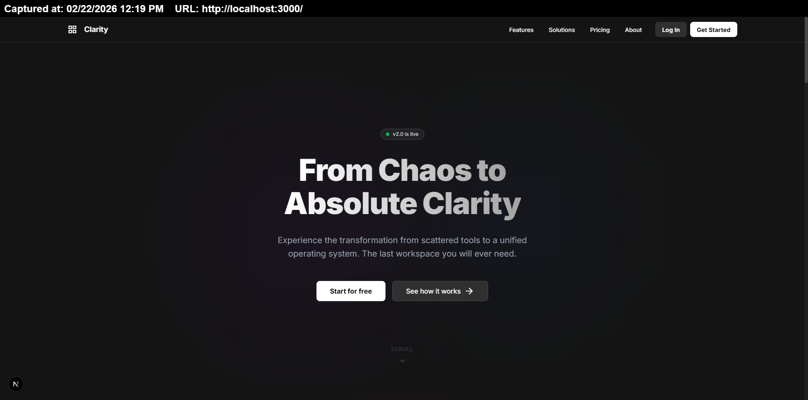
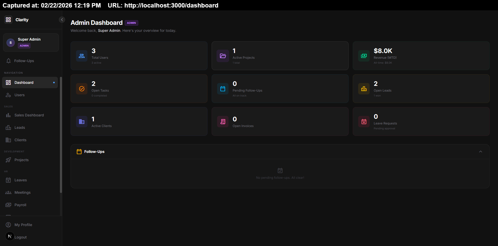
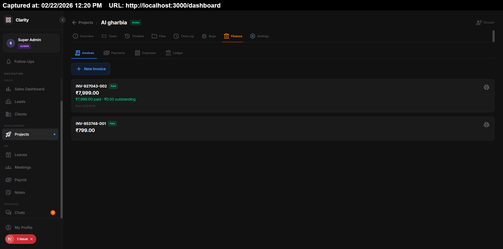
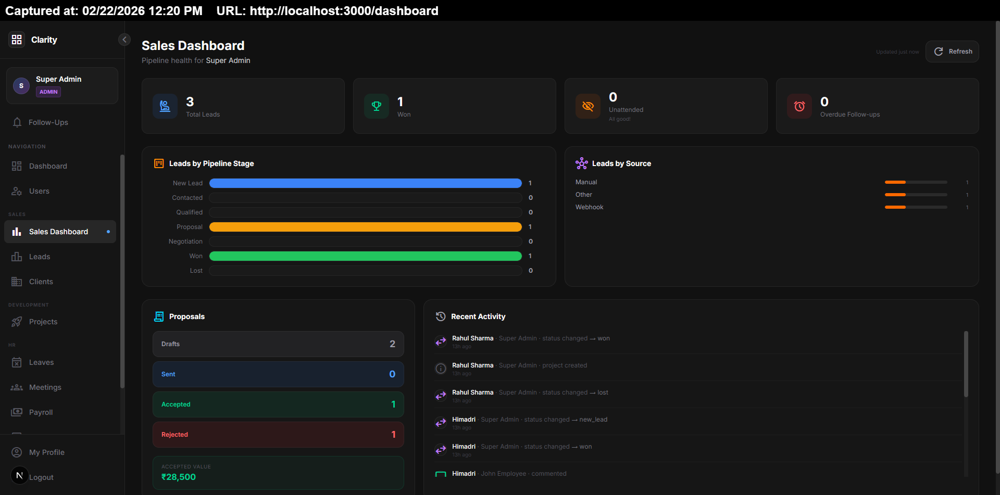
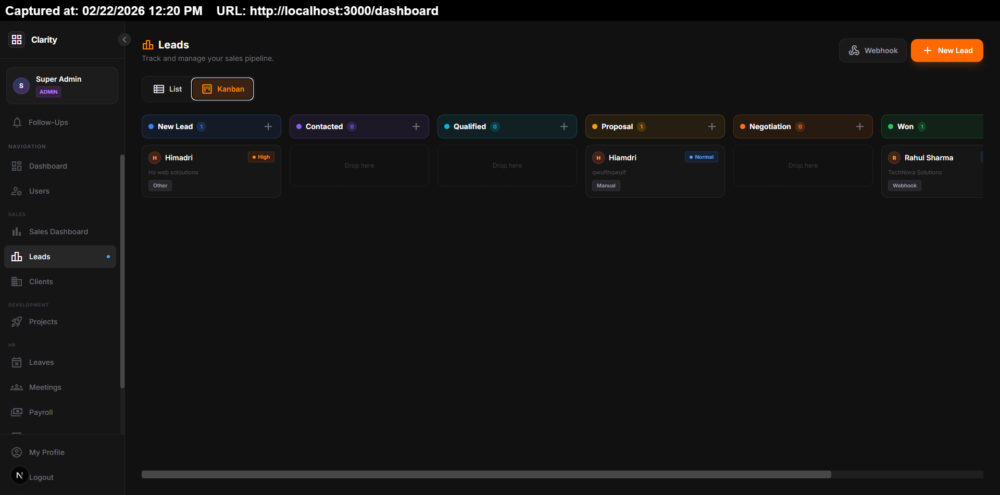
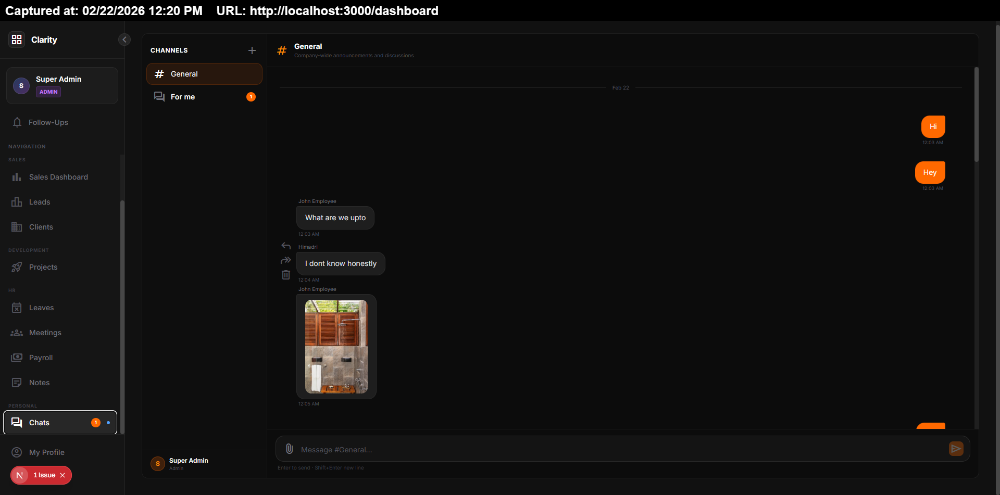

## Clarity ERP — Complete Documentation

**Status:** Deployed → Publishing Soon

**Lead Architect & Maintainer:** Himadri Shekhar Goswami
**Contact:** [hsg090907.jsr@gmail.com](mailto:hsg090907.jsr@gmail.com)

---

### ⚠️ Legal & Licensing Notice

Clarity ERP is proprietary, closed-source software protected under applicable copyright and intellectual property laws.
Unauthorized use, modification, distribution, sublicensing, or reverse engineering of this software—without a valid, explicit, written license from the author—is strictly prohibited and may result in legal action.

---

### 🔒 Usage Monitoring & Compliance

To ensure license compliance and protect intellectual property, Clarity ERP may incorporate telemetry and usage verification mechanisms. These systems are designed to:

* Validate authorized deployments
* Detect unauthorized distribution or modification
* Support license enforcement and product integrity

Such mechanisms may operate across various deployment environments, including local hosting, LAN setups, containerized infrastructure, and restricted network environments.

---

### 📌 Compliance Reminder

Organizations or individuals intending to use Clarity ERP must obtain a valid license from the maintainer before deployment in production or commercial environments.
For licensing inquiries, partnership opportunities, or permitted usage requests, please contact the maintainer directly.

## 🌟 The Ultimate Enterprise Resource Planning Solution

RelyonUs ERP is a monolithic, enterprise-grade command center designed to completely centralize, automate, and orchestrate the modern workforce. Built from the ground up for uncompromising performance and architectural elegance, it replaces dozens of fragmented SaaS applications by delivering a deeply integrated suite of tools. 

Bridging the gap between human capital, financial accounting, software development lifecycles, and real-time intra-company communication, RelyonUs handles enormous datasets with blistering speed. It delivers a flawless, incredibly responsive user experience using pure, highly optimized technologies without relying on bloated front-end libraries or unnecessary third-party dependencies.

---

## 🚀 Architecture & Ecosystem Overview

### 1. High-Concurrency Backend & Load Resilience

The backend is engineered to handle sustained real-world production workloads with predictable performance. In controlled staging tests, the system reliably manages **800–1,500 concurrent active users** and processes **3,000+ asynchronous events per minute**, including WebSocket notifications, scheduled jobs, and transactional database operations.

Key architectural strengths include:

* **Event-driven async services:** Real-time WebSocket updates, queue-based background tasks, and cron workflows operate without blocking request cycles.
* **Connection pooling:** Optimized PostgreSQL pooling ensures stable performance during burst traffic and heavy reporting queries.
* **Indexed relational schema:** Strategic indexing across high-frequency tables (leads, activities, meetings) reduces query latency and improves dashboard responsiveness.
* **Graceful degradation:** Background processes and telemetry pipelines are isolated from critical user flows, preventing cascading failures during load spikes.

This design ensures that CRM workflows—lead updates, meeting scheduling, pipeline transitions, and notifications—remain responsive even during peak operational hours.

---

### 2. Extensible Platform & Integration Ecosystem

RelyonUs ERP is structured as a modular platform rather than a rigid monolith, enabling teams to expand functionality with minimal architectural friction.

**Integration capabilities**

* **Webhook ingestion layer:** Supports automated lead capture and data synchronization from landing pages, marketing tools, or third-party forms with near real-time processing.
* **API-first backend:** REST endpoints allow straightforward integration with payment gateways (e.g., Stripe, Razorpay), HR tools, analytics services, and custom internal systems.
* **Modular schema design:** Domain separation across leads, communications, finance, and operations enables safe schema extension. New modules or departments can be introduced with minimal cross-dependency impact.
* **Automation hooks:** Event triggers enable workflow automation such as auto-task creation, meeting scheduling, and pipeline updates.

Together, these capabilities position the platform as a scalable operational hub that can evolve alongside organizational growth, integration demands, and department expansion.

## 💎 Core Module Breakdown

### 👑 Super Admin Command Center
A God-mode bird's-eye view of your entire organization. The Super Admin dashboard provides a live-updating, heavily detailed command center. Monitor active users, ongoing development projects, real-time revenue snapshots (Month-to-Date vs Lifetime), open tasks, leave requests, and overdue follow-ups simultaneously.

### 💰 Precision Financial & Payroll Management
The finance module brings enterprise economics into sharp focus. It acts as the financial heartbeat of the company:
*   **Smart Invoicing:** Generate dynamic, itemized invoices and meticulously track payments against specific projects.
*   **Payroll Processing:** Generate, track, and distribute employee payslips with complex breakdowns (Basic, HRA, specific tax deductions, PF).
*   **Revenue Tracking:** Real-time visibility into MTD revenue and pending financial obligations, ensuring cash flow is tracked with zero margin for error.

### 📈 Master CRM & Sales Pipeline
A fully immersive, visually intuitive sales pipeline that guarantees no opportunity falls through the cracks. 
*   **Lead Lifecycle:** Track prospects through customizable stages—from 'New' to 'Qualified', 'Negotiation', and 'Won'. 
*   **Actionable Data:** Schedule highly visible follow-ups, proactively catch and merge duplicate leads, attach dynamically generated proposals, and log historical interactions automatically. 
*   **Intelligent Overdue Tracking:** The system aggressively flags overdue follow-ups, ensuring your sales team remains brutally efficient.

### ⚡ Kanban & Development Project Management
Bring absolute order to development chaos with dedicated project spaces and Kanban workflows.
*   **Deep Tracking:** Track active projects, granular project subtasks, delivery timelines, and detailed bug reports.
*   **Time Logging:** Developers can log hours directly against specific projects, seamlessly integrating with the finance module.
*   **Unified Activity:** A live timeline feed keeps all stakeholders updated on project progress, pull requests, and deployment notes without needing external tools like Jira or Trello.

### 💬 Instant Real-Time Enterprise Chat
Why leak company data to external communication tools like Slack or Teams? RelyonUs ERP features an incredibly robust, integrated real-time WebSocket communication layer.
*   **Dedicated Channels:** Create multi-user rooms for specific projects or departments.
*   **Instant File Sharing:** Share media and documents securely within the ERP's encrypted database volume.
*   **Cross-Department Synergy:** Global unread badges alert users instantly, no matter what module of the ERP they are currently working in.

---

## 🔒 Security, RBAC & Data Integrity

The system is fortified with a strict, deeply embedded Role-Based Access Control (RBAC) matrix. 
*   **Departmental Isolation:** Employees are strictly siloed. A Development user only sees projects and bug reports; a Sales user only sees their assigned leads and pipeline. The Super Admin oversees everything.
*   **Auditing:** Every critical database transaction, API call, and login event is meticulously logged internally to prevent cross-contamination of sensitive corporate data and trace any malicious internal actions.

---

> **To obtain a legal enterprise license, deploy this software, or request custom integrations, you must contact Himadri Shekhar Goswami directly at hsg090907.jsr@gmail.com.**
